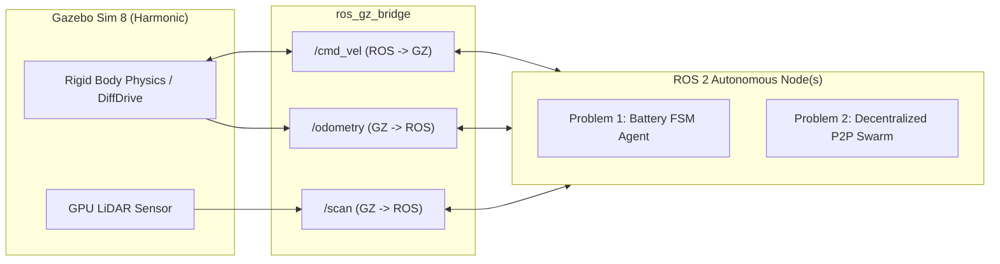
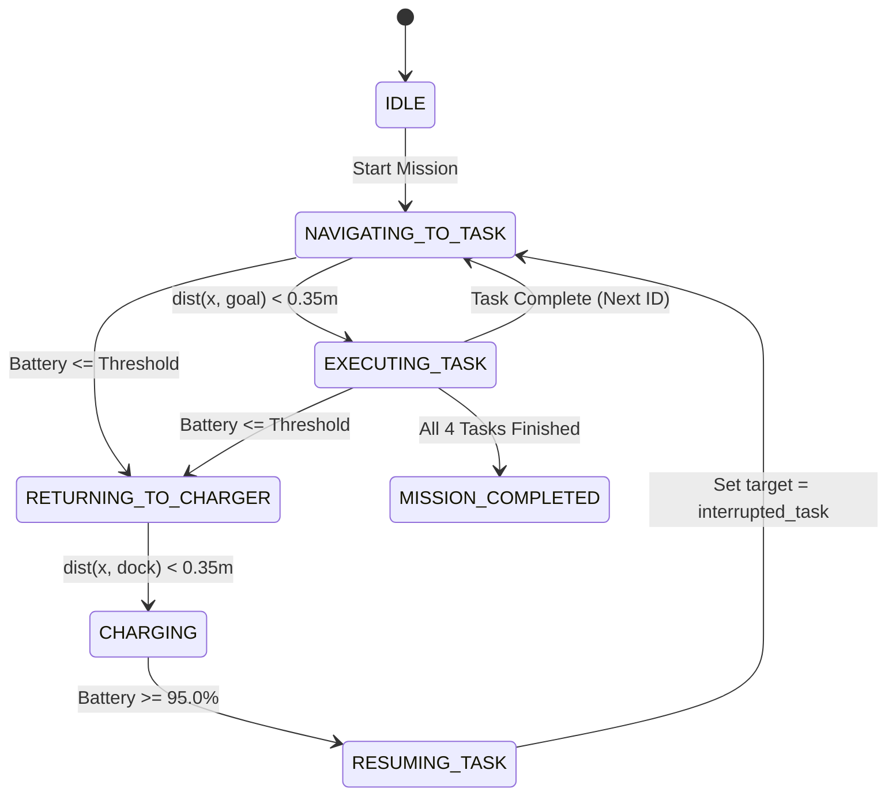

# Deep-Dive Technical Explanation: Problem 1 & Problem 2
**Lab 8: Mobile Robot Navigation Using ROS 2 Jazzy & Gazebo Sim Harmonic**

---

## Table of Contents
1. [Overview & System Architecture](#1-overview--system-architecture)
2. [Problem 1: Battery-Aware Autonomous Robot Agent](#2-problem-1-battery-aware-autonomous-robot-agent)
   - [2.1 Core Problem & Concept](#21-core-problem--concept)
   - [2.2 Mathematical Model & Energy Budgeting](#22-mathematical-model--energy-budgeting)
   - [2.3 Finite State Machine (FSM) Decision Engine](#23-finite-state-machine-fsm-decision-engine)
   - [2.4 In-Depth Code Walkthrough (`problem1_battery_aware_robot_node.py`)](#24-in-depth-code-walkthrough)
   - [2.5 Gazebo Environment & Hardware Emulation](#25-gazebo-environment--hardware-emulation)
3. [Problem 2: Decentralized Multi-Robot Exploration](#3-problem-2-decentralized-multi-robot-exploration)
   - [3.1 Core Problem & Decentralization Principle](#31-core-problem--decentralization-principle)
   - [3.2 The Four Algorithmic Pillars](#32-the-four-algorithmic-pillars)
   - [3.3 Mathematical Formulation of Frontier Utility & Peer Repulsion](#33-mathematical-formulation)
   - [3.4 In-Depth Code Walkthrough (`problem2_decentralized_exploration_node.py`)](#34-in-depth-code-walkthrough)
   - [3.5 Multi-Robot World & Physics Setup](#35-multi-robot-world--physics-setup)
   - [3.6 Anatomy of the "Robot 3" Obstacle Bug & Its Physics Fix](#36-anatomy-of-the-robot-3-bug--fix)
4. [Comparative Summary (Problem 1 vs Problem 2)](#4-comparative-summary)
5. [Quick Execution Cheatsheet](#5-quick-execution-cheatsheet)

---

## 1. Overview & System Architecture

Both problems solve foundational challenges in autonomous mobile robotics using:
- **ROS 2 Jazzy Jalisco**: Node execution, topic pub/sub, inter-process threading.
- **Gazebo Sim 8 (Harmonic)**: Physics engine, ODE collision dynamics, 2D GPU LiDAR sensor simulation, differential drive actuators.
- **`ros_gz_bridge`**: Translates Gazebo Transport messages (`gz.msgs.*`) into standard ROS 2 messages (`geometry_msgs`, `nav_msgs`, `sensor_msgs`).



---

## 2. Problem 1: Battery-Aware Autonomous Robot Agent

### 2.1 Core Problem & Concept
In industrial automated guided vehicles (AGVs) or hospital delivery robots, battery exhaustion while executing missions far from a dock causes critical logistics bottlenecks. An agent cannot simply navigate blindly until 0% battery; it must possess **self-awareness of its energetic state**.

The agent must:
1. Sequentially visit 4 designated task workstations distributed in the arena.
2. Dwell for 3.0 seconds at each station to simulate real-world work (inspection, picking, assembly).
3. Continuously project its energy-to-go back to the charging dock.
4. **Preemptively abort** when battery drops below safety reserve ($28\%$).
5. Return to dock $(0, 0)$, rapid-recharge to $95\%$, and **resume the exact unfinished task**.

---

### 2.2 Mathematical Model & Energy Budgeting

#### 1. Dynamic Battery Discharge
The battery state of charge $B(t) \in [0.0, 100.0]\%$ follows a multi-rate drain model:
$$\frac{dB}{dt} = 
\begin{cases} 
+R_{charge} = +7.5\%/\text{s}, & \text{if docked in } \text{CHARGING} \\
-(R_{idle} + R_{motion} \cdot \frac{|v|}{v_{max}}), & \text{if moving in field} \\
-R_{idle} = -0.15\%/\text{s}, & \text{if stationary dwelling}
\end{cases}$$
Where $R_{motion} = 1.35\%/\text{s}$ and $v_{max} = 0.45\text{ m/s}$.

#### 2. Dynamic Return Threshold
The decision to abort considers Euclidean distance to dock $d_{dock} = \sqrt{x^2 + y^2}$:
$$E_{needed} = \left(\frac{d_{dock}}{v_{max}}\right) \cdot R_{motion} + E_{safety\_margin}$$
If $B(t) \le \max(28.0\%, E_{needed})$, preemption triggers immediately.

---

### 2.3 Finite State Machine (FSM) Decision Engine



---

### 2.4 In-Depth Code Walkthrough
File: [`problem1_battery_aware_robot_node.py`](file:///home/sravanthi/GAZEBO/LAB_8/problem1_battery_aware_robot_node.py)

#### Key Data Structures & Initialization:
```python
class Problem1BatteryAwareRobotNode(Node):
    def __init__(self):
        super().__init__('problem1_battery_aware_robot_node')
        # ROS Communication
        self.cmd_pub = self.create_publisher(Twist, '/problem1/cmd_vel', 10)
        self.battery_pub = self.create_publisher(BatteryState, '/problem1/battery_state', 10)
        self.status_pub = self.create_publisher(String, '/problem1/task_status', 10)
        self.odom_sub = self.create_subscription(Odometry, '/problem1/odometry', self.odom_callback, 10)
        self.scan_sub = self.create_subscription(LaserScan, '/problem1/scan', self.scan_callback, qos_profile_sensor_data)
```
- **Odometry Callback (`odom_callback`)**: Converts orientation quaternion $q = (x, y, z, w)$ to planar yaw $\theta = \text{atan2}(2(wz + xy), 1 - 2(y^2 + z^2))$.
- **LiDAR Callback (`scan_callback`)**: Slices 180 laser beams into angular sectors:
  - Front Sector: $[-20^\circ, +20^\circ]$ $\to$ forward clearance.
  - Left Sector: $[+20^\circ, +80^\circ]$ $\to$ left clearance.
  - Right Sector: $[-80^\circ, -20^\circ]$ $\to$ right clearance.

#### Motion & Obstacle Steer Controller (`navigate_towards`):
```python
def navigate_towards(self, target_x, target_y):
    dx = target_x - self.x
    dy = target_y - self.y
    dist = math.hypot(dx, dy)
    goal_yaw = math.atan2(dy, dx)
    heading_err = (goal_yaw - self.yaw + math.pi) % (2.0 * math.pi) - math.pi

    cmd = Twist()
    if self.min_front < 0.65:
        # Repulsive obstacle bypass: slow down and pivot toward open side
        cmd.linear.x = 0.05
        cmd.angular.z = self.max_ang_speed if self.min_left > self.min_right else -self.max_ang_speed
    elif abs(heading_err) > 0.45:
        # Turn-in-place heading alignment
        cmd.linear.x = 0.05
        cmd.angular.z = math.copysign(self.max_ang_speed, heading_err)
    else:
        # Smooth pursuit
        speed_scale = max(0.2, min(1.0, dist / 2.0))
        cmd.linear.x = self.max_lin_speed * speed_scale
        cmd.angular.z = 1.2 * heading_err
    return cmd, dist
```

#### Preemption & Memory Resumption Logic:
```python
# Check battery vs required return margin
if self.battery_level <= max(self.low_battery_threshold, estimated_energy_to_dock):
    self.get_logger().warn(f"LOW BATTERY: {self.battery_level:.1f}%! Aborting to Dock.")
    self.interrupted_task_idx = self.current_task_idx  # Save memory pointer
    self.state = self.STATE_RETURNING_TO_CHARGER
```
When docking finishes:
```python
if self.battery_level >= self.full_battery_threshold: # >= 95%
    self.current_task_idx = self.interrupted_task_idx  # Restore exact interrupted task
    self.state = self.STATE_RESUMING_TASK
```

---

### 2.5 Gazebo Environment & Hardware Emulation
File: [`problem1_battery_aware_robot_world.sdf`](file:///home/sravanthi/GAZEBO/LAB_8/problem1_battery_aware_robot_world.sdf)
- **Charging Station**: Centered at $(0.0, 0.0)$, visual blue base pad with vertical docking pylon.
- **Task Stations**: 4 colored pads (Inspection, Pickup, Assembly, Quality) positioned at outer coordinates $(4.5, 3.5)$, $(5.0, -4.0)$, $(-4.5, -3.5)$, and $(-4.0, 4.0)$.
- **Obstacle Crates**: Placed midway between aisles to mandate real-time LiDAR obstacle dodging.
- **Robot Chassis**: Differential drive with two drive wheels, two low-friction casters, and a roof-mounted 2D GPU LiDAR.

---

## 3. Problem 2: Decentralized Multi-Robot Exploration

### 3.1 Core Problem & Decentralization Principle
In search-and-rescue (e.g. earthquake rubble) or subterranean tunnel reconnaissance:
- **No Central Coordinator**: There is no base station master node assigning paths. If one robot fails, the swarm continues.
- **Dispersed Starting Positions**: Robots spawn in distinct corners of an unknown multi-room facility.
- **Local Sensor Horizons**: Each robot only sees what is within its LiDAR reach ($8.0\text{ m}$).
- **Anti-Redundancy Requirement**: Robots must not cluster into the same room.
- **Lossy Communication**: Robots must function even when out of radio range ($> 7.0\text{ m}$).

---

### 3.2 The Four Algorithmic Pillars

```
+-----------------------------------------------------------------------------------+
|                           DECENTRALIZED EXPLORATION                               |
+-----------------------------------------------------------------------------------+
|  1. Local Occupancy Grid   -->  Bresenham raycasting from LiDAR into 46x46 grid   |
|  2. Frontier Extraction    -->  Identify boundary cells between Free and Unknown  |
|  3. P2P Information Sharing -->  Broadcast (x, y, claimed_goal) over mesh network |
|  4. Anti-Redundancy Utility-->  Score frontiers with heavy penalties for peer goals|
+-----------------------------------------------------------------------------------+
```

---

### 3.3 Mathematical Formulation

#### 1. Local Occupancy Grid
The world is discretized into a 2D matrix $M[y][x]$ with resolution $\Delta = 0.35\text{ m}$:
$$M[y][x] \in \{-1 \text{ (unknown)}, 0 \text{ (free)}, 100 \text{ (occupied)}\}$$
Every laser beam from angle $\theta$ and range $r$ traces a line from robot $(x_0, y_0)$ to beam endpoint $(x_1, y_1)$. All intermediate cells along the ray are cleared to $0$ (free), and the terminal cell is marked $100$ (occupied).

#### 2. Frontier Definition
A cell $c = (gx, gy)$ is a **frontier cell** if:
$$M[gy][gx] == 0 \quad \text{AND} \quad \exists (dx, dy) \in \mathcal{N}_8 : M[gy + dy][gx + dx] == -1$$

#### 3. Frontier Cost-Utility Scoring with Peer Goal Repulsion
For every candidate frontier cluster $f = (f_x, f_y)$, its score $S(f)$ is computed as:
$$S(f) = U_{base} - \alpha \cdot d(f, \mathbf{x}_{robot}) - \sum_{j \in \text{Peers}} \Phi(f, \text{Peer}_j)$$

Where:
- $d(f, \mathbf{x}_{robot}) = \sqrt{(f_x - x)^2 + (f_y - y)^2}$ is traversal cost.
- $\alpha = 1.2$ (distance weight).
- $\Phi(f, \text{Peer}_j)$ is the **Anti-Redundancy Penalty**:
$$\Phi(f, \text{Peer}_j) = 
\begin{cases} 
+20.0, & \text{if } d(f, \mathbf{goal}_j) < 3.5\text{ m (peer already claimed this zone)} \\
(4.0 - d(f, \mathbf{x}_j)) \times 4.0, & \text{if peer currently near this zone } (d < 4.0\text{ m}) \\
0.0, & \text{otherwise}
\end{cases}$$

This mathematical repulsion guarantees that if Robot 1 claims a frontier in the Southwest corridor, Robot 2's utility score for that entire sector drops by $-20.0$, forcing Robot 2 to choose the Northeast corridor instead!

#### 4. Communication Loss Handling
Before applying peer penalties, the age of peer packets is checked:
$$\Delta t = t_{now} - t_{last\_pkt}$$
If $\Delta t > 4.0\text{ s}$ or $\text{dist}(\text{robot}, \text{peer}) > 7.0\text{ m}$, the link is declared **dropped**. The peer entry is ignored, and the robot gracefully degrades to purely local frontier-based navigation without stalling.

---

### 3.4 In-Depth Code Walkthrough
File: [`problem2_decentralized_exploration_node.py`](file:///home/sravanthi/GAZEBO/LAB_8/problem2_decentralized_exploration_node.py)

#### 1. Bresenham 2D Raytracing Engine:
```python
def raytrace(self, x0, y0, x1, y1, is_hit):
    gx0, gy0 = self.world_to_grid(x0, y0)
    gx1, gy1 = self.world_to_grid(x1, y1)
    dx, dy = abs(gx1 - gx0), abs(gy1 - gy0)
    sx = 1 if gx0 < gx1 else -1
    sy = 1 if gy0 < gy1 else -1
    err = dx - dy
    x, y = gx0, gy0

    while True:
        if 0 <= x < self.grid_size and 0 <= y < self.grid_size:
            if x == gx1 and y == gy1:
                self.grid[y][x] = 100 if is_hit else 0
                break
            else:
                self.grid[y][x] = 0  # Mark line of sight as free
        if x == gx1 and y == gy1:
            break
        e2 = 2 * err
        if e2 > -dy: err -= dy; x += sx
        if e2 < dx:  err += dx; y += sy
```

#### 2. Frontier Detection Loop:
```python
def extract_frontiers(self):
    frontiers = []
    for gy in range(1, self.grid_size - 1):
        for gx in range(1, self.grid_size - 1):
            if self.grid[gy][gx] == 0:  # Known free space
                # Look for unknown neighbor (-1) in 8-neighborhood
                if any(self.grid[gy + dy][gx + dx] == -1 for dy in (-1, 0, 1) for dx in (-1, 0, 1)):
                    wx, wy = self.grid_to_world(gx, gy)
                    frontiers.append((wx, wy))
    return frontiers
```

#### 3. Peer Broadcast & Comm Loss Filter:
```python
def peer_cb(self, msg: String):
    payload = json.loads(msg.data)
    sender = payload.get("id")
    if sender == self.robot_id: return

    px, py = payload.get("x", 0.0), payload.get("y", 0.0)
    dist_to_peer = math.hypot(px - self.x, py - self.y)

    # Physical radio range limit: packet dropped if > 7.0m
    if dist_to_peer > self.comms_range_cutoff:
        return

    self.peer_data[sender] = {
        "x": px, "y": py,
        "goal": payload.get("goal"),
        "time": time.time()
    }
```

#### 4. Obstacle Avoidance & Auto-Recovery Stuck Detection:
```python
# 1. Multi-tier reactive collision avoidance
if self.min_front < 0.40:
    # Danger zone: reverse and pivot away
    cmd.linear.x = -0.15
    cmd.angular.z = 0.8 if self.min_left > self.min_right else -0.8
elif self.min_front < 0.65:
    # Caution zone: rotate in place (0 forward speed prevents wall scraping)
    cmd.linear.x = 0.0
    cmd.angular.z = 0.75 if self.min_left > self.min_right else -0.75
else:
    # Pursuit toward frontier target
    cmd.linear.x = min(0.40, max(0.15, dist * 0.3))
    cmd.angular.z = 1.0 * heading_err

# 2. Deadlock / wedging auto-recovery
pos_dist_change = math.hypot(self.x - self.prev_x, self.y - self.prev_y)
if getattr(self, 'stuck_timer', 0) > 0:
    self.stuck_timer -= 1
    cmd.linear.x = -0.18
    cmd.angular.z = 0.75
elif cmd.linear.x > 0.05 and pos_dist_change < 0.03:
    self.stuck_counter += 1
    if self.stuck_counter > 20:   # Stalled for > 2.0s
        self.stuck_timer = 15     # Force reverse-pivot maneuver
        self.target_goal = None   # Drop unreachable goal, pick fresh frontier!
        self.stuck_counter = 0
```

---

### 3.5 Multi-Robot World & Physics Setup
File: [`problem2_decentralized_exploration_world.sdf`](file:///home/sravanthi/GAZEBO/LAB_8/problem2_decentralized_exploration_world.sdf)

1. **Partitioned Environment**: $16\text{ m} \times 16\text{ m}$ arena split into 4 quadrant rooms:
   - Southwest Room: $[-8 \to 0, -8 \to 0]$
   - Southeast Room: $[0 \to 8, -8 \to 0]$
   - Northwest Room: $[-8 \to 0, 0 \to 8]$
   - Northeast Room: $[0 \to 8, 0 \to 8]$
   - Doorways are $3.5\text{ m}$ wide in both horizontal and vertical partition walls.

2. **Distinct Spawn Positions**:
   - `robot1` (Blue): Spawns at $(-5.5, -5.0)$ in SW room.
   - `robot2` (Green): Spawns at $(+5.5, -5.0)$ in SE room.
   - `robot3` (Orange): Spawns at $(-5.0, +5.0)$ in NW room.

---

### 3.6 Anatomy of the "Robot 3" Obstacle Bug & Its Physics Fix

#### What Happened in Gazebo:
1. **Spawn Collision**: `partition_v_north` was centered at $x = 0.0$ extending from $y = 1.75$ to $y = 7.75$. Robot 3 was originally spawned at $(0.0, 5.5)$, meaning it materialized **directly inside the collision box of the wall**. The ODE physics engine wedged its drive wheels.
2. **Chassis Tipping**: The robot originally had only a single caster wheel. When reversing or pivoting, the rear edge of the base link dragged against the ground with friction, starving the wheels of traction.
3. **Wall Creep**: The earlier collision check applied `cmd.linear.x = 0.05` when near walls, continually pushing the chassis into doorway corners.

#### How It Was Solved:
1. **Spawn Moved to Open Space**: Robot 3 now spawns at $(-5.0, 5.0)$ in the open center of the NW room.
2. **Dual-Caster Stabilization**: Added both `caster_f` ($+0.24\text{ m}$) and `caster_r` ($-0.24\text{ m}$) with frictionless spheres ($\mu = 0.01$). The robot now has 4 stable ground contact points and cannot tip.
3. **Zero-Forward-Speed Pivoting & Active Reverse**: When closer than $0.65\text{ m}$, forward velocity drops to $0.0\text{ m/s}$. Below $0.40\text{ m}$, it reverses at $-0.15\text{ m/s}$.
4. **Auto-Recovery Watchdog**: If a robot remains stationary for $> 2.0\text{ s}$, it automatically cancels the target, backs up, and selects an open alternate frontier.

---

## 4. Comparative Summary

| Feature | Problem 1: Battery-Aware Agent | Problem 2: Decentralized Multi-Robot |
| :--- | :--- | :--- |
| **Fleet Size** | Single Mobile Robot | 3 Autonomous Robots (`robot1`, `robot2`, `robot3`) |
| **Control Paradigm** | Central FSM State Engine | Completely Decentralized (No central controller) |
| **Mapping** | Pre-mapped waypoint stations | Online unknown occupancy grid mapping |
| **Decision Driver** | Battery state of charge (SoC) vs distance to dock | Frontier utility minus peer claimed targets |
| **Inter-Robot Comms** | None (Single agent) | Ad-hoc mesh broadcast (`/exploration/peer_broadcast`) |
| **Failure / Edge Case** | Low battery preemption, return to dock, resume | Comm loss ($> 7\text{ m}$), corner wedging recovery |
| **Key ROS Topics** | `/problem1/cmd_vel`, `/battery_state`, `/task_status` | `/robot{1..3}/cmd_vel`, `/scan`, `/peer_broadcast` |

---

## 5. Quick Execution Cheatsheet

### Problem 1 (Terminal 1, 2, 3)
```bash
# Terminal 1: Gazebo
source /opt/ros/jazzy/setup.bash && export LIBGL_ALWAYS_SOFTWARE=1 && cd ~/GAZEBO/LAB_8
gz sim -r problem1_battery_aware_robot_world.sdf

# Terminal 2: Bridge
source /opt/ros/jazzy/setup.bash && cd ~/GAZEBO/LAB_8
ros2 run ros_gz_bridge parameter_bridge --ros-args -p config_file:=problem1_battery_aware_robot_bridge.yaml

# Terminal 3: Autonomous Agent
source /opt/ros/jazzy/setup.bash && cd ~/GAZEBO/LAB_8
python3 problem1_battery_aware_robot_node.py
```

---

### Problem 2 (Terminal 1, 2, 3)
```bash
# Terminal 1: Gazebo
source /opt/ros/jazzy/setup.bash && export LIBGL_ALWAYS_SOFTWARE=1 && cd ~/GAZEBO/LAB_8
gz sim -r problem2_decentralized_exploration_world.sdf

# Terminal 2: Multi-Robot Bridge
source /opt/ros/jazzy/setup.bash && cd ~/GAZEBO/LAB_8
ros2 run ros_gz_bridge parameter_bridge --ros-args -p config_file:=problem2_decentralized_exploration_bridge.yaml

# Terminal 3: All 3 Decentralized Agents
source /opt/ros/jazzy/setup.bash && cd ~/GAZEBO/LAB_8
python3 problem2_decentralized_exploration_node.py --robot all
```
