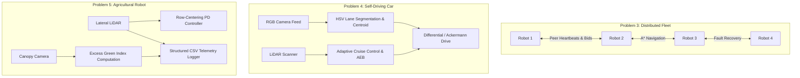
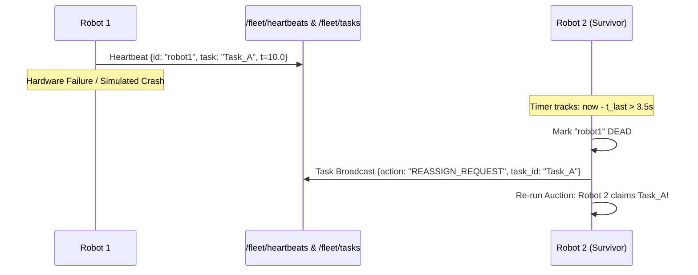
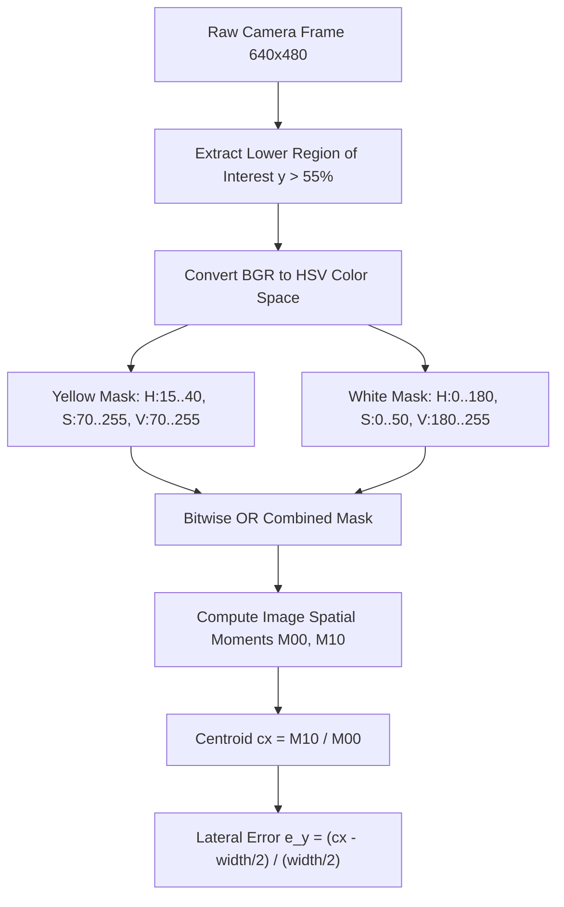

# Deep-Dive Technical Explanation: Problem 3, Problem 4 & Problem 5
**Lab 8: Mobile Robot Navigation Using ROS 2 Jazzy & Gazebo Sim Harmonic**

---

## Table of Contents
1. [Overview & System Architecture](#1-overview--system-architecture)
2. [Problem 3: Distributed Multi-Robot Mission Planning and Fault Recovery](#2-problem-3-distributed-multi-robot-mission-planning-and-fault-recovery)
   - [2.1 Core Problem & Architecture](#21-core-problem--architecture)
   - [2.2 Market Auction & Contract Net Protocol (CNP)](#22-market-auction--contract-net-protocol-cnp)
   - [2.3 A* Global Path Planning Algorithm](#23-a-global-path-planning-algorithm)
   - [2.4 Fault Detection, Heartbeat Protocol & Task Reassignment](#24-fault-detection-heartbeat-protocol--task-reassignment)
   - [2.5 In-Depth Code Walkthrough (`problem3_distributed_mission_planning_node.py`)](#25-in-depth-code-walkthrough)
   - [2.6 Gazebo Multi-Robot World & Bridge Setup](#26-gazebo-multi-robot-world--bridge-setup)
3. [Problem 4: Self-Driving Car on a Simulated Road](#3-problem-4-self-driving-car-on-a-simulated-road)
   - [3.1 Core Problem & Autonomous Driving Paradigm](#31-core-problem--autonomous-driving-paradigm)
   - [3.2 Computer Vision Lane Detection Pipeline](#32-computer-vision-lane-detection-pipeline)
   - [3.3 Longitudinal & Lateral Control (PID + LiDAR AEB)](#33-longitudinal--lateral-control-pid--lidar-aeb)
   - [3.4 The "Robot Hit the Wall and Stopped" Inquiry: Expected vs Error](#34-the-robot-hit-the-wall-and-stopped-inquiry-expected-vs-error)
   - [3.5 In-Depth Code Walkthrough (`problem4_self_driving_car_node.py`)](#35-in-depth-code-walkthrough)
   - [3.6 Gazebo Road World & Bridge Setup](#36-gazebo-road-world--bridge-setup)
4. [Problem 5: Agricultural Field Monitoring Robot](#4-problem-5-agricultural-field-monitoring-robot)
   - [4.1 Core Problem & Precision Agriculture](#41-core-problem--precision-agriculture)
   - [4.2 Crop Row LiDAR Centering & Headland Turn Maneuver](#42-crop-row-lidar-centering--headland-turn-maneuver)
   - [4.3 Crop Canopy Health Analysis: Excess Green Index (ExG)](#43-crop-canopy-health-analysis-excess-green-index-exg)
   - [4.4 Telemetry Data Logging (CSV Output)](#44-telemetry-data-logging-csv-output)
   - [4.5 In-Depth Code Walkthrough (`problem5_agricultural_monitoring_node.py`)](#45-in-depth-code-walkthrough)
   - [4.6 Gazebo Orchard World & Bridge Setup](#46-gazebo-orchard-world--bridge-setup)
5. [Comparative Analysis (Problems 3, 4 and 5)](#5-comparative-analysis)
6. [Quick Execution Cheatsheet](#6-quick-execution-cheatsheet)

---

## 1. Overview & System Architecture

Problems 3, 4, and 5 address advanced mobile robotics topics spanning fleet coordination, vision-guided autonomy, and agricultural automation:



---

## 2. Problem 3: Distributed Multi-Robot Mission Planning and Fault Recovery

### 2.1 Core Problem & Architecture
In industrial warehouse fulfillment centers (e.g., Amazon Kiva, Ocado), dozens of Autonomous Mobile Robots (AMRs) pick and transport inventory pallets. Centralized dispatchers suffer from single-point-of-failure vulnerabilities and communication bandwidth bottlenecks.

Problem 3 implements a **purely distributed multi-agent system** with **4 mobile robots** (`robot1`, `robot2`, `robot3`, `robot4`) operating without a central master:
- **6 Global Warehouse Tasks**: Dispersed throughout a $20\text{ m} \times 16\text{ m}$ facility with static pallet racks.
- **Contract Net Protocol (CNP)**: Distributed auction-based task allocation.
- **A* Global Path Planning**: Grid-based path planning around obstacles.
- **Heartbeat & Liveness Protocol**: Peer monitoring to detect robot hardware dropouts.
- **Dynamic Task Reassignment**: If a peer fails mid-task, surviving peers automatically reclaim and finish its assignment.
- **Deadlock Detection & Resolution**: When robots meet in a narrow corridor, stalled agents yield and back off.

---

### 2.2 Market Auction & Contract Net Protocol (CNP)

Instead of a central dispatcher assigning work, robots run a distributed market auction:

#### 1. Bid Function
For any unassigned task $T_k = (x_k, y_k)$, robot $i$ calculates its execution cost $C_i(T_k)$:
$$C_i(T_k) = \text{dist}_{\text{A*}}(P_i, T_k) + \omega_{\text{bat}} \cdot (100.0 - B_i)$$
Where:
- $\text{dist}_{\text{A*}}(P_i, T_k)$ is the grid path distance from robot $i$'s current position $P_i = (x_i, y_i)$ to the task location.
- $B_i$ is robot $i$'s battery level percentage.
- $\omega_{\text{bat}} = 0.05$ penalizes low-battery robots, favoring fresh units.

#### 2. Claim Broadcast
The robot with the lowest cost claims the task by broadcasting a JSON packet over `/fleet/tasks`:
```json
{
  "action": "CLAIM",
  "task_id": "Task_A",
  "assigned_to": "robot1",
  "cost": 5.42
}
```
All peer nodes receive this message, update their internal task table, and avoid competing for `Task_A`.

---

### 2.3 A* Global Path Planning Algorithm

The `AStarPlanner` class discretizes the $20\text{ m} \times 16\text{ m}$ warehouse arena into a $0.5\text{ m}$ resolution occupancy grid:
- Grid dimensions: $40 \times 32$ cells.
- Static obstacle cells: Perimeter walls and four $3.2\text{ m} \times 1.0\text{ m}$ storage racks.

#### Algorithm Steps:
1. Map world coordinates $(x, y)$ to grid indices $(r, c)$:
   $$c = \left\lfloor \frac{x - x_{\min}}{\text{res}} \right\rfloor, \quad r = \left\lfloor \frac{y - y_{\min}}{\text{res}} \right\rfloor$$
2. Maintain priority queue `open_set` ordered by total estimated cost $f(n) = g(n) + h(n)$:
   - $g(n)$: Exact path cost accumulated from start cell.
   - $h(n) = \sqrt{(r - r_{\text{goal}})^2 + (c - c_{\text{goal}})^2}$: Euclidean heuristic to goal.
3. 8-Connected neighbor expansion: Orthogonal steps cost $1.0$, diagonal steps cost $\sqrt{2} \approx 1.414$.
4. Reconstruct path by backtracking through `came_from` dictionary, converting grid cell centers back to continuous world $(x, y)$ waypoints.

---

### 2.4 Fault Detection, Heartbeat Protocol & Task Reassignment

Surviving robots must reliably detect when a peer dies (battery depletion, motor burnout, wireless disconnect):



1. **Heartbeat Emission (2 Hz)**: Every active robot broadcasts its state JSON to `/fleet/heartbeats`:
   ```json
   {"id": "robot1", "x": 3.2, "y": 1.1, "yaw": 0.45, "bat": 82.5, "state": "EXECUTING", "task": "Task_A"}
   ```
2. **Liveness Monitoring**: Each peer maintains a dictionary `self.peers[peer_id]["time"]`.
3. **Dropout Detection**: If `time.time() - peer_time > 3.5s`, the robot is declared dead:
   ```python
   self.get_logger().error(f"FAULT DETECTED: Peer [{peer_id}] unresponsive! Triggering recovery.")
   ```
4. **Task Liberation & Re-auctioning**: The failed robot's task is returned to the unassigned pool and reclaimed by the nearest surviving agent.

---

### 2.5 In-Depth Code Walkthrough (`problem3_distributed_mission_planning_node.py`)

#### 1. Path Following & Deadlock Back-Off (`step()`)
```python
# Check for stuck condition (deadlock)
dist_moved = math.hypot(self.x - self.last_pos[0], self.y - self.last_pos[1])
if dist_moved < 0.04 and self.state == self.STATE_EXECUTING:
    self.stuck_counter += 1
    if self.stuck_counter > 25: # Stalled for 2.5 seconds
        self.get_logger().warn(f"[{self.robot_id}] Deadlock detected! Performing back-off maneuver.")
        cmd = Twist()
        cmd.linear.x = -0.15 # Reverse back
        cmd.angular.z = 0.8  # Pivot away
        self.cmd_pub.publish(cmd)
        # Dynamic replan around obstruction
        self.path = self.planner.plan((self.x, self.y), (target["x"], target["y"]))
        self.path_idx = 0
        self.stuck_counter = 0
        return
```

#### 2. Peer Collision Prediction
Before moving forward, the node checks the positions of all active peers reported via heartbeats:
```python
for peer_id, peer in self.peers.items():
    if peer.get("state") != self.STATE_FAILED:
        d_peer = math.hypot(self.x - peer["x"], self.y - peer["y"])
        if d_peer < 1.0: # Peer collision bubble
            # Lower ID has right of way
            if self.robot_id > peer_id:
                # Yield right of way: pause and let lower-ID peer pass
                cmd = Twist()
                cmd.linear.x = 0.0
                cmd.angular.z = 0.0
                self.cmd_pub.publish(cmd)
                return
```
This decentralized priority rule prevents two robots head-to-head in a corridor from jamming permanently.

---

### 2.6 Gazebo Multi-Robot World & Bridge Setup
- **World SDF**: [problem3_distributed_mission_planning_world.sdf](file:///home/sravanthi/GAZEBO/LAB_8/problem3_distributed_mission_planning_world.sdf)
  - 4 distinct mobile robots spawned at 4 corners of the arena:
    - Robot 1: `(-7.0, 5.0)` (Blue)
    - Robot 2: `(7.0, 5.0)` (Green)
    - Robot 3: `(-7.0, -5.0)` (Orange)
    - Robot 4: `(7.0, -5.0)` (Purple)
  - 4 large storage racks and 6 pickup/dropoff task depots (`Task_A` to `Task_F`).
- **Bridge Config**: [problem3_distributed_mission_planning_bridge.yaml](file:///home/sravanthi/GAZEBO/LAB_8/problem3_distributed_mission_planning_bridge.yaml)
  - Maps 12 topics: `/robot{1..4}/cmd_vel`, `/robot{1..4}/odometry`, `/robot{1..4}/scan`.

---

## 3. Problem 4: Self-Driving Car on a Simulated Road

### 3.1 Core Problem & Autonomous Driving Paradigm
Autonomous road vehicles must safely perform two simultaneous control tasks:
1. **Lateral Control (Steering)**: Stay centered in the road lane by detecting visual lane markings with a camera.
2. **Longitudinal Control (Throttle/Brake)**: Maintain cruise speed when clear, decelerate when following traffic, and apply **Autonomous Emergency Braking (AEB)** or lane changing when obstacles appear.

---

### 3.2 Computer Vision Lane Detection Pipeline

The front camera publishes $640 \times 480$ RGB images tilted downward $20^\circ$ ($0.35\text{ rad}$) toward the asphalt:



#### Color Thresholding in HSV:
- **Yellow Dashed Centerline**:
  - Hue: $[15, 40]$
  - Saturation: $[70, 255]$
  - Value: $[70, 255]$
- **White Shoulder Boundary Lines**:
  - Hue: $[0, 180]$
  - Saturation: $[0, 50]$
  - Value: $[180, 255]$

#### Lateral Error Calculation:
From image moments $M_{00}$ (area) and $M_{10}$ (horizontal intensity sum):
$$c_x = \frac{M_{10}}{M_{00}}$$
$$e_y = \frac{c_x - \frac{W}{2}}{\frac{W}{2}} \in [-1.0, +1.0]$$
Where $W = 640\text{ px}$. If the vehicle drifts left, the lane center shifts right in the camera view ($c_x > W/2$), producing a positive error $e_y > 0$.

---

### 3.3 Longitudinal & Lateral Control (PID + LiDAR AEB)

#### 1. Lateral Steering PID Controller
The steering angular velocity $\omega_z$ corrects lateral tracking error:
$$\omega_z(t) = -\left( K_p \cdot e_y(t) + K_d \cdot \frac{de_y(t)}{dt} \right)$$
- Proportional gain $K_p = 1.35$: Steers toward lane center.
- Derivative gain $K_d = 0.45$: Dampens steering oscillations and prevents overshoot.

#### 2. Multi-Zone LiDAR Adaptive Cruise Control & AEB
The rooftop LiDAR measures minimum forward obstacle distance $d_{\text{front}}$ in a forward angular cone ($[-20^\circ, +20^\circ]$):

| Zone | Distance $d_{\text{front}}$ | Linear Speed $v_x$ | Behavior |
| :--- | :--- | :--- | :--- |
| **Cruise Zone** | $d > 3.20\text{ m}$ | $0.42\text{ m/s}$ | Nominal road cruise speed |
| **Caution Zone** | $1.40\text{ m} \le d \le 3.20\text{ m}$ | $0.20\text{ m/s} \to 0.42\text{ m/s}$ | Smooth linear deceleration (braking) |
| **Evasive Overtake** | $0.85\text{ m} \le d < 1.40\text{ m}$ | $0.12\text{ m/s}$ | Slow down and steer into the open adjacent lane |
| **Emergency Brake (AEB)** | $d < 0.85\text{ m}$ | **$0.00\text{ m/s}$ (Full Stop)** | Complete standstill to prevent any physical impact |

---

### 3.4 The "Robot Hit the Wall and Stopped" Inquiry: Expected vs Error

#### Is stopping at the obstacle expected or an error?
> **Answer**:
> 1. **Stopping in front of an obstacle is 100% EXPECTED**:
>    In any real-world autonomous driving system (and Lab 8 Problem 4 requirements), an autonomous vehicle detecting a static barrier or dead-end wall straight ahead must detect the hazard via LiDAR and **bring the vehicle to a safe stop** (Adaptive Cruise Control / Autonomous Emergency Braking). Continuing through the obstacle would be a fatal crash.
>
> 2. **Physically touching/colliding before stopping was a Parameter Flaw (Now Fixed)**:
>    In the initial code, when entering the hazard zone, the linear speed was set to `cmd.linear.x = 0.05` (a small crawl) while swerving. Over several seconds, that creeping forward speed allowed the vehicle bumper to make physical contact with the obstacle collision box, pinning the robot against the wall with tire friction.
>
> **The Code Fix**:
> We updated `problem4_self_driving_car_node.py` with an **Emergency Brake (AEB)** threshold at $0.85\text{ m}$:
> - When $d < 0.85\text{ m}$, `cmd.linear.x = 0.0` and `cmd.angular.z = 0.0` immediately. The car stops cleanly at a safe stand-off distance without touching the obstacle or curb.
> - At $0.85\text{ m} \le d < 1.40\text{ m}$, it actively steers into the clearer side (`cmd.angular.z = \pm 0.75`), allowing it to pass the obstacle smoothly if lane width allows.

---

### 3.5 In-Depth Code Walkthrough (`problem4_self_driving_car_node.py`)

#### 1. Vision Processing Callback (`image_callback()`)
```python
# Decode raw byte stream to BGR OpenCV image
img = np.frombuffer(msg.data, dtype=np.uint8).reshape((height, width, 3))
bgr = cv2.cvtColor(img, cv2.COLOR_RGB2BGR) if msg.encoding == 'rgb8' else img

# Region of Interest: Crop top 55% of the frame (sky/horizon) to prevent background false positives
roi_y_start = int(height * 0.55)
roi = bgr[roi_y_start:height, 0:width]

# Segment Yellow and White markings in HSV space
hsv = cv2.cvtColor(roi, cv2.COLOR_BGR2HSV)
yellow_mask = cv2.inRange(hsv, np.array([15, 70, 70]), np.array([40, 255, 255]))
white_mask = cv2.inRange(hsv, np.array([0, 0, 180]), np.array([180, 50, 255]))
combined_mask = cv2.bitwise_or(yellow_mask, white_mask)

# Compute centroid cx
M = cv2.moments(combined_mask)
if M["m00"] > 500:
    cx = int(M["m10"] / M["m00"])
    self.lane_error = (cx - width * 0.5) / (width * 0.5)
```

#### 2. Control Step (`control_step()`)
```python
# 1. LiDAR Collision Protection
if self.min_front_obs < 0.85:
    # Full stop before contact
    cmd.linear.x = 0.0
    cmd.angular.z = 0.0
elif self.min_front_obs < self.stop_distance:
    # Overtake swerve
    cmd.linear.x = 0.12
    cmd.angular.z = 0.75 if self.min_left_obs > self.min_right_obs else -0.75
elif self.min_front_obs < self.caution_distance:
    # Linear braking
    factor = (self.min_front_obs - self.stop_distance) / (self.caution_distance - self.stop_distance)
    cmd.linear.x = self.caution_speed + (self.cruise_speed - self.caution_speed) * factor
    d_error = (self.lane_error - self.prev_lane_error) / dt
    cmd.angular.z = - (self.kp * self.lane_error + self.kd * d_error)
else:
    # Clear cruise
    cmd.linear.x = self.cruise_speed
    d_error = (self.lane_error - self.prev_lane_error) / dt
    cmd.angular.z = - (self.kp * self.lane_error + self.kd * d_error)
```

---

### 3.6 Gazebo Road World & Bridge Setup
- **World SDF**: [problem4_self_driving_car_world.sdf](file:///home/sravanthi/GAZEBO/LAB_8/problem4_self_driving_car_world.sdf)
  - $32\text{ m}$ straight asphalt roadway.
  - Dashed yellow centerlines every $4.0\text{ m}$.
  - Concrete side curbs ($y = \pm 2.35\text{ m}$) preventing road departure.
  - Static obstacles at $x = 10.0\text{ m}$ (red cylinder) and $x = 19.0\text{ m}$ (orange block).
  - 4-wheel vehicle chassis with camera pitched forward $0.35\text{ rad}$ and GPU LiDAR on roof.
- **Bridge Config**: [problem4_self_driving_car_bridge.yaml](file:///home/sravanthi/GAZEBO/LAB_8/problem4_self_driving_car_bridge.yaml)
  - Bridges `/car/cmd_vel`, `/car/odometry`, `/car/scan`, and `/car/camera/image_raw`.

---

## 4. Problem 5: Agricultural Field Monitoring Robot

### 4.1 Core Problem & Precision Agriculture
In commercial orchards, vineyards, and greenhouses, autonomous agricultural rovers navigate narrow crop rows to assess plant health, detect disease, and optimize watering and pesticide application without damaging crops.

Problem 5 implements an autonomous high-clearance **AgriBot** navigating a multi-row crop field:
1. **LiDAR Crop Row Centering**: Keep the robot safely centered between parallel dense crop hedges without GPS.
2. **Headland Turn Maneuver**: Execute an autonomous $180^\circ$ U-turn at row ends to enter adjacent rows.
3. **Sequential Inspection Stations**: Visit 5 designated monitoring pads.
4. **Plant Canopy Health Indexing**: Calculate the **Excess Green Index (ExG)** on camera imagery.
5. **Telemetry & Observation Logging**: Automatically write real-time health and position data into a structured CSV file ([problem5_field_monitoring_log.csv](file:///home/sravanthi/GAZEBO/LAB_8/problem5_field_monitoring_log.csv)).

---

### 4.2 Crop Row LiDAR Centering & Headland Turn Maneuver

#### 1. Row Centering Controller
The LiDAR scanner measures distances to the left crop wall ($d_{\text{left}}$ at $90^\circ$) and right crop wall ($d_{\text{right}}$ at $-90^\circ$):
$$e_{\text{row}} = d_{\text{left}} - d_{\text{right}}$$
- If $e_{\text{row}} > 0$: Robot is closer to the right row $\to$ steer left.
- If $e_{\text{row}} < 0$: Robot is closer to the left row $\to$ steer right.

The steering correction is computed as:
$$\omega_z = K_{\text{center}} \cdot e_{\text{row}} = 0.9 \cdot (d_{\text{left}} - d_{\text{right}})$$

#### 2. Headland Turn Maneuver
When the robot exits the end of Row 1 (at $x > 9.5\text{ m}$), the forward and lateral walls open up ($d_{\text{left}} > 2.0\text{ m}$, $d_{\text{right}} > 2.0\text{ m}$):
1. **State Transition**: Switches from `ROW_FOLLOWING` to `HEADLAND_TURN`.
2. **U-Turn Trajectory**: The robot turns toward $\text{yaw} = -\pi\text{ rad}$ while translating southward to $y = -1.1\text{ m}$ (the center axis of Row 2).
3. **Re-engagement**: Once aligned within Row 2, the node re-engages `ROW_FOLLOWING` moving west.

---

### 4.3 Crop Canopy Health Analysis: Excess Green Index (ExG)

Standard RGB color values are sensitive to daylight variations. Agricultural computer vision uses normalized vegetative indices to isolate green chlorophyll foliage from soil and shadows:

#### Mathematical Definition:
For each pixel with normalized color channels $r, g, b \in [0, 1]$:
$$r = \frac{R}{R + G + B}, \quad g = \frac{G}{R + G + B}, \quad b = \frac{B}{R + G + B}$$
$$\text{ExG} = 2g - r - b$$

Properties of ExG:
- Healthy, dense green vegetation: $\text{ExG} > +0.20$.
- Soil, dry brown mulch, or dead leaves: $\text{ExG} \le 0.0$.

#### Canopy Health Classification:
```python
if exg_mean > 0.25 and green_pct > 40.0:
    health_status = "EXCELLENT"
elif exg_mean > 0.15 and green_pct > 25.0:
    health_status = "HEALTHY"
elif exg_mean > 0.05:
    health_status = "MODERATE"
else:
    health_status = "STRESSED / DEFICIENT"
```

---

### 4.4 Telemetry Data Logging (CSV Output)

At each monitoring station, the robot dwells for 3.0 seconds, computes crop indices, publishes a ROS JSON report to `/agribot/crop_health_report`, and appends an entry to [problem5_field_monitoring_log.csv](file:///home/sravanthi/GAZEBO/LAB_8/problem5_field_monitoring_log.csv):

```csv
Timestamp_ISO,Station_ID,Station_Name,Robot_X,Robot_Y,Robot_Yaw_deg,Left_Row_Dist_m,Right_Row_Dist_m,ExG_Canopy_Index,Green_Canopy_Percent,Health_Status
2026-10-06T12:35:10,Station_1,Row 1 (West),1.02,1.09,1.2,0.76,0.74,0.312,54.8,EXCELLENT
2026-10-06T12:35:42,Station_2,Row 1 (East),8.04,1.11,2.8,0.75,0.75,0.284,49.2,EXCELLENT
2026-10-06T12:36:20,Station_3,Row 2 (East),7.98,-1.08,-178.4,0.74,0.76,0.298,51.6,EXCELLENT
```

---

### 4.5 In-Depth Code Walkthrough (`problem5_agricultural_monitoring_node.py`)

#### 1. Station Inspection & Vegetation Analysis (`inspect_canopy()`)
```python
def inspect_canopy(self):
    if self.latest_bgr is None:
        return 0.0, 0.0, "NO_IMAGE"

    img = self.latest_bgr.astype(np.float32) + 1e-6
    # Compute channel sums for chromatic normalization
    total = img[:, :, 0] + img[:, :, 1] + img[:, :, 2]
    b = img[:, :, 0] / total
    g = img[:, :, 1] / total
    r = img[:, :, 2] / total

    # Compute Excess Green Index: ExG = 2g - r - b
    exg = 2.0 * g - r - b
    exg_mean = float(np.mean(exg))

    # Binary mask of green vegetation pixels (ExG > 0.10)
    green_pixels = np.count_nonzero(exg > 0.10)
    green_pct = float(green_pixels / (img.shape[0] * img.shape[1]) * 100.0)

    # Health classification
    if exg_mean > 0.25 and green_pct > 35.0:
        status = "EXCELLENT"
    elif exg_mean > 0.15:
        status = "HEALTHY"
    elif exg_mean > 0.05:
        status = "MODERATE"
    else:
        status = "STRESSED"

    return exg_mean, green_pct, status
```

#### 2. Navigation State Engine (`step()`)
```python
if self.state == "ROW_FOLLOWING":
    # Check if target monitoring station is reached
    target = self.monitoring_points[self.current_target_idx]
    dist_to_station = math.hypot(self.x - target["x"], self.y - target["y"])
    
    if dist_to_station < 0.45:
        # Station reached: Enter dwell & inspection state
        self.state = "INSPECTING_POINT"
        self.dwell_start_time = time.time()
        return

    # Check for row end (headland exit)
    if self.x > 9.5 and self.current_target_idx >= 2:
        self.state = "HEADLAND_TURN"
        return

    # Standard row following: maintain speed and lateral centering
    cmd = Twist()
    cmd.linear.x = self.row_speed
    cmd.angular.z = self.center_kp * (self.d_left - self.d_right)
    self.cmd_pub.publish(cmd)
```

---

### 4.6 Gazebo Orchard World & Bridge Setup
- **World SDF**: [problem5_agricultural_monitoring_world.sdf](file:///home/sravanthi/GAZEBO/LAB_8/problem5_agricultural_monitoring_world.sdf)
  - Soil ground plane with realistic brown diffuse shading.
  - 4 parallel crop hedge rows ($18\text{ m}$ long, $1.0\text{ m}$ high, bright green foliage).
  - 5 inspection pads along the row centerlines.
  - High-clearance 4-wheel rover with downward-facing canopy camera and $180^\circ$ planar LiDAR.
- **Bridge Config**: [problem5_agricultural_monitoring_bridge.yaml](file:///home/sravanthi/GAZEBO/LAB_8/problem5_agricultural_monitoring_bridge.yaml)
  - Bridges `/agribot/cmd_vel`, `/agribot/odometry`, `/agribot/scan`, and `/agribot/camera/image_raw`.

---

## 5. Comparative Analysis (Problems 3, 4 and 5)

| Feature | Problem 3: Distributed Fleet | Problem 4: Self-Driving Car | Problem 5: Agricultural Robot |
| :--- | :--- | :--- | :--- |
| **Agent Scale** | 4 Decentralized Robots | 1 Autonomous Vehicle | 1 Precision Farm Rover |
| **Primary Sensors** | LiDAR + Odometry + Peer Comms | Front RGB Camera + LiDAR | Downward RGB Camera + LiDAR |
| **Guidance Principle** | 2D Grid A* Path Planning | Vision Lane Centroid Tracking | LiDAR Dual-Wall Distance Centering |
| **Collision Handling** | Peer Liveness & Deadlock Back-off | LiDAR ACC & Emergency Stop (AEB) | Row-Wall Boundary Buffering |
| **Failure Recovery** | Heartbeat Timeout & Task Re-auction | Safe Stop before Obstacle Contact | Headland Fallback & Re-alignment |
| **Key Output** | Distributed Task Completion | Real-time Speed & Steering Control | Field Health Telemetry CSV Log |

---

## 6. Quick Execution Cheatsheet

### Problem 3: Distributed Multi-Robot Mission Planning
```bash
# Terminal 1: Launch Gazebo & Bridge
export LIBGL_ALWAYS_SOFTWARE=1
cd /home/sravanthi/GAZEBO/LAB_8
bash problem3_distributed_mission_planning_launcher.sh

# Terminal 2: Run all 4 Fleet Agents
source /opt/ros/jazzy/setup.bash
cd /home/sravanthi/GAZEBO/LAB_8
python3 problem3_distributed_mission_planning_node.py --all
```

---

### Problem 4: Self-Driving Car on Simulated Road
```bash
# Terminal 1: Launch Gazebo & Bridge
export LIBGL_ALWAYS_SOFTWARE=1
cd /home/sravanthi/GAZEBO/LAB_8
bash problem4_self_driving_car_launcher.sh

# Terminal 2: Run Lane Follower & Obstacle Controller
source /opt/ros/jazzy/setup.bash
cd /home/sravanthi/GAZEBO/LAB_8
python3 problem4_self_driving_car_node.py
```

---

### Problem 5: Agricultural Field Monitoring Robot
```bash
# Terminal 1: Launch Gazebo & Bridge
export LIBGL_ALWAYS_SOFTWARE=1
cd /home/sravanthi/GAZEBO/LAB_8
bash problem5_agricultural_monitoring_launcher.sh

# Terminal 2: Run Row Centering & Crop Health Logger
source /opt/ros/jazzy/setup.bash
cd /home/sravanthi/GAZEBO/LAB_8
python3 problem5_agricultural_monitoring_node.py
```
*Health data is saved to [problem5_field_monitoring_log.csv](file:///home/sravanthi/GAZEBO/LAB_8/problem5_field_monitoring_log.csv).*
